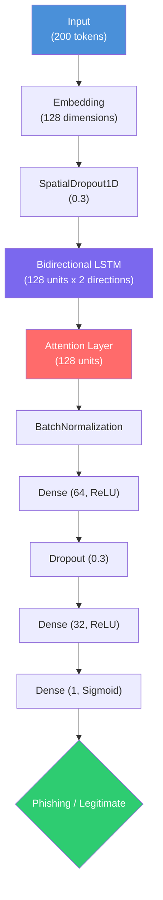
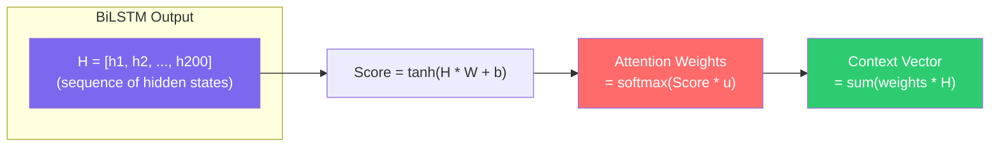
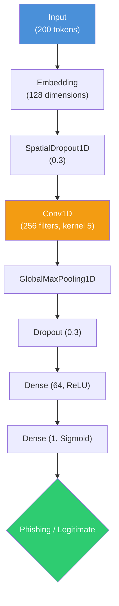
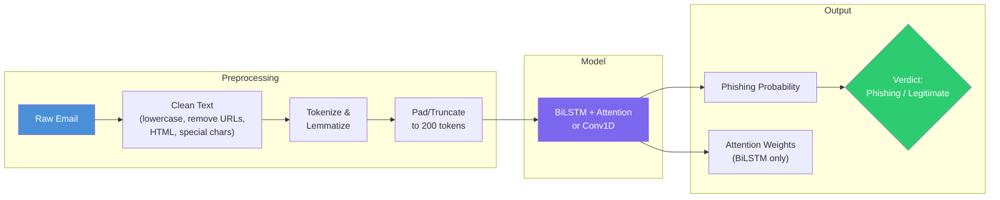
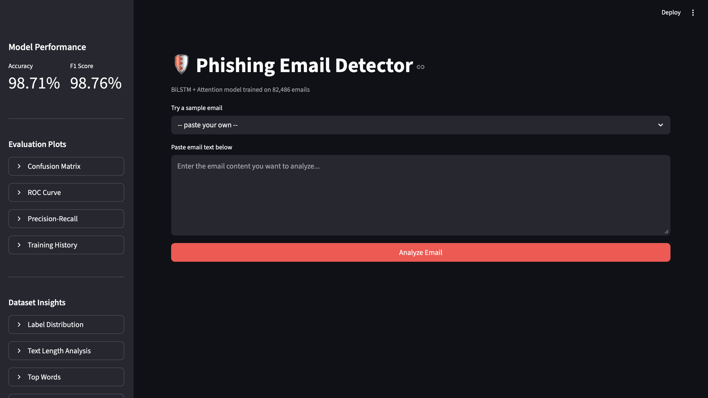
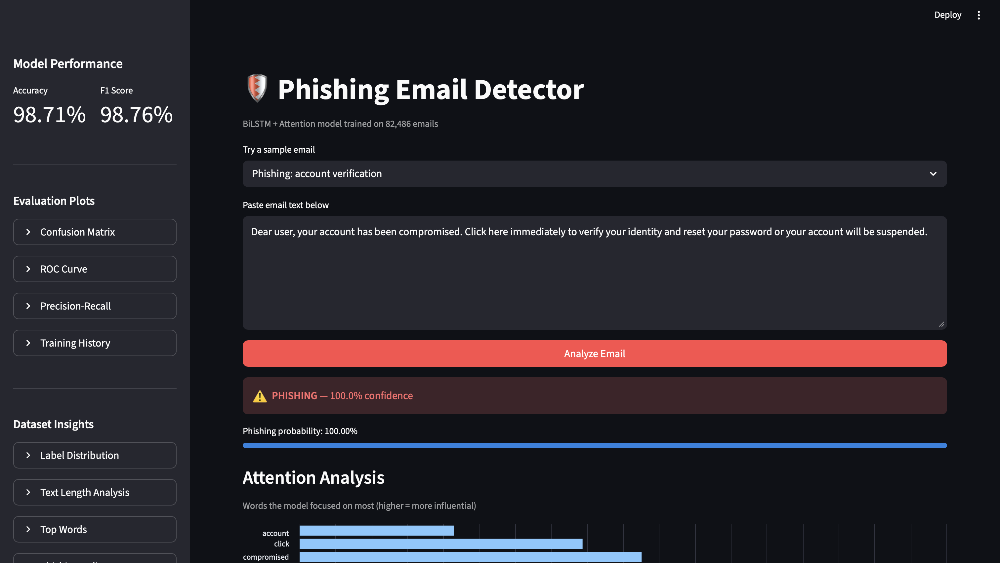
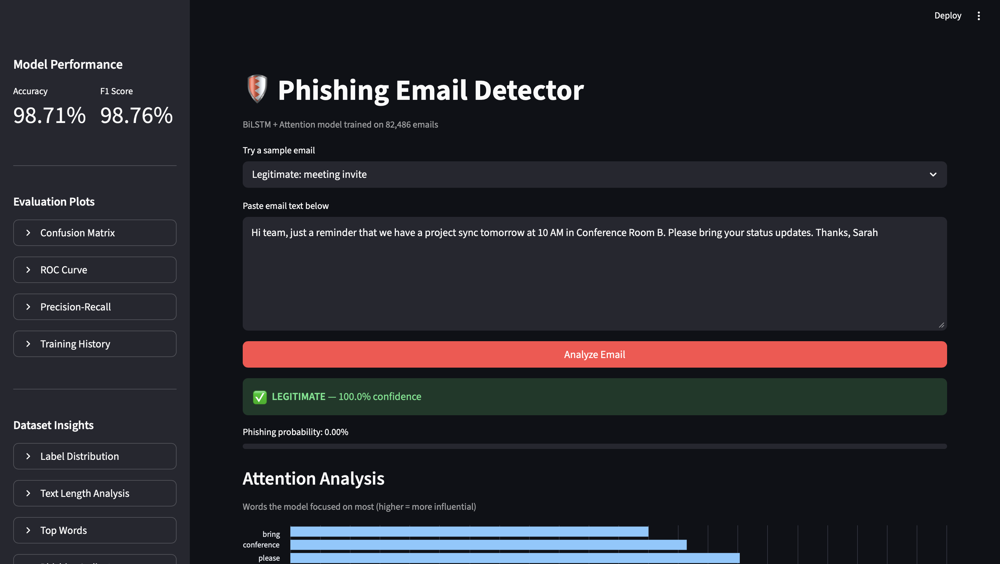
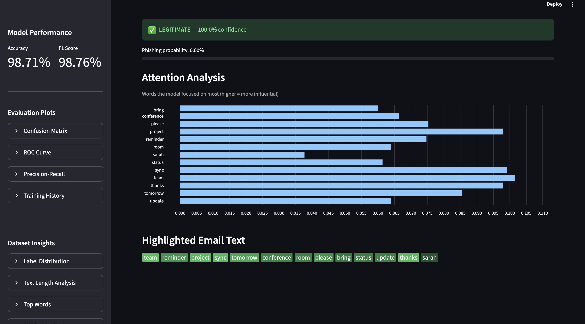
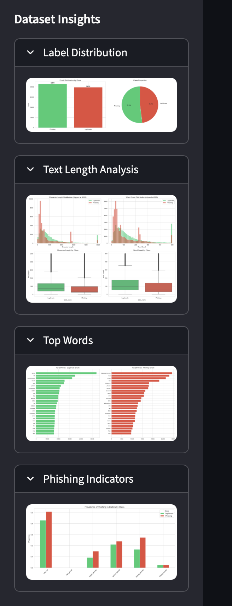

# LSTM-Driven Phishing Detection for Enterprise Email Security

A Bidirectional LSTM model with an attention mechanism to classify phishing emails in enterprise email systems. The model analyzes email content (subject lines, message bodies, and structure) to detect phishing patterns that mimic normal workplace communication.

## Project Structure

```
InfoSec-Project10/
├── Dataset/                    # Phishing email dataset (82,486 emails)
│   ├── phishing_email.csv      # Main combined dataset (used for training)
│   ├── CEAS_08.csv
│   ├── Enron.csv
│   ├── Ling.csv
│   ├── Nazario.csv
│   ├── Nigerian_Fraud.csv
│   └── SpamAssasin.csv
├── src/
│   ├── preprocess.py           # Text cleaning, tokenization, sequence preparation
│   ├── model.py                # BiLSTM + Attention and optional fast Conv1D
│   ├── paths.py                # MODEL_ARCH / MODEL_PATH to checkpoint file
│   ├── train.py                # Training pipeline with checkpointing
│   ├── evaluate.py             # Standalone evaluation (no retraining needed)
│   ├── explain.py              # LIME/SHAP explainability analysis
│   ├── api.py                  # FastAPI REST API for deployment
│   └── app.py                  # Streamlit interactive frontend
├── notebooks/
│   └── eda.ipynb               # Exploratory Data Analysis
├── models/                     # Saved model weights and tokenizer
│   ├── best_model.keras        # Best BiLSTM (MODEL_ARCH=bilstm)
│   ├── best_model_conv.keras   # Best Conv1D (MODEL_ARCH=conv)
│   ├── tokenizer.pkl           # Fitted tokenizer
│   ├── X_test.npy              # Test features (for evaluation)
│   └── y_test.npy              # Test labels (for evaluation)
├── results/                    # Evaluation results and plots
│   ├── classification_report.txt
│   ├── metrics.json
│   ├── confusion_matrix.png
│   ├── roc_curve.png
│   ├── precision_recall_curve.png
│   ├── training_history.png
│   ├── label_distribution.png
│   ├── text_length_analysis.png
│   ├── top_words.png
│   ├── phishing_indicators.png
│   └── explanations/
│       ├── attention_phishing.png
│       ├── attention_legitimate.png
│       ├── lime_phishing.html
│       └── lime_legitimate.html
├── screenshots/                # Streamlit app screenshots
├── requirements.txt
├── Dockerfile
└── README.md
```

## Model Architecture

### BiLSTM + Attention (Default)



### Attention Mechanism Detail



> The attention mechanism learns which words in the email are most indicative of phishing, providing interpretability alongside classification.

### Conv1D (Fast Alternative)



### End-to-End Pipeline



**Key design choices:**
- **Bidirectional LSTM**: Captures context from both directions in email text
- **Attention Mechanism**: Learns which words/phrases are most indicative of phishing, improving interpretability
- **Conv1D Alternative**: Much faster on GPU/Metal with comparable accuracy, trades attention interpretability for speed
- **Regularization**: SpatialDropout1D, Dropout, L2 regularization, and BatchNormalization to prevent overfitting

**BiLSTM Parameters**: 6,715,777 (25.62 MB)

## Dataset

The [Phishing Email Dataset](https://www.kaggle.com/datasets/naserabdullahalam/phishing-email-dataset/data) contains:
- **82,486 emails** (42,891 phishing / 39,595 legitimate)
- **Columns**: `text_combined` (email text), `label` (0 = legitimate, 1 = phishing)
- Sources: CEAS_08, Enron, Ling, Nazario, Nigerian Fraud, SpamAssassin

## Setup

### Prerequisites
- Python 3.10+
- pip

### Download Dataset

The dataset is not included in this repository due to file size limits. Download it from Kaggle:

1. Go to the [Phishing Email Dataset](https://www.kaggle.com/datasets/naserabdullahalam/phishing-email-dataset/data) on Kaggle
2. Download and extract the CSV files into the `Dataset/` directory

### Install Dependencies

```bash
pip install -r requirements.txt
```

This project pins NumPy to **1.x** (`numpy>=1.24,<2` in `requirements.txt`) because TensorFlow wheels expect the NumPy 1.x ABI. If pip upgrades you to NumPy 2.x and imports fail, run `pip install "numpy>=1.24,<2"`. **SHAP** is capped below 0.50 so it stays compatible with NumPy 1.x.

Download NLTK data (run once):
```python
import nltk
nltk.download('stopwords')
nltk.download('punkt')
nltk.download('punkt_tab')
nltk.download('wordnet')
```

## Usage

### 1. Training

```bash
python src/train.py
```

- Preprocesses all 82K emails (cleaning, tokenization, lemmatization)
- Splits data: 70% train / 10% validation / 20% test
- Default **`MODEL_ARCH=bilstm`**: BiLSTM + attention, saves `models/best_model.keras`
- **Auto-saves** the best model based on validation loss
- **Skips retraining** if an existing checkpoint for that architecture has >=95% validation accuracy
- Saves accuracy-milestone checkpoints in `models/`

Training uses `tf.data` with **prefetch** so the next batch is prepared while the device runs the current step.

**Fastest throughput (recommended on GPU/Metal):** Conv1D over the same token sequences is usually much faster than an LSTM:

```bash
MODEL_ARCH=conv TF_JIT=1 python src/train.py
```

Saves `models/best_model_conv.keras` (default batch **512**; override with `TRAIN_BATCH_SIZE`). For `evaluate.py`, `api.py`, and `explain.py`, set **`MODEL_ARCH=conv`** or **`MODEL_PATH`** to that file. Attention plots are skipped for conv models.

**Faster BiLSTM** (keeps attention for interpretability):

```bash
FAST_RNN=1 TRAIN_BATCH_SIZE=256 TF_JIT=1 python src/train.py
```

`FAST_RNN=1` sets LSTM recurrent dropout to 0 (often faster on accelerators).

**Other tuning**

- **Apple Silicon GPU**: Plain `pip install tensorflow` on macOS is CPU-only; use `requirements-macos-metal.txt` for Metal (see that file for install order).
- **Parallel preprocessing**: `PREPROCESS_WORKERS=1` forces single-process (debugging).
- **Batch size**: BiLSTM default **128**; conv default **512** (`TRAIN_BATCH_SIZE`).
- **Thread pool (CPU)**: Optional `TF_INTRA_OP_THREADS` and `TF_INTER_OP_THREADS`.
- **Mixed precision (GPU)**: `TF_MIXED_PRECISION=1` when a GPU is visible (disable if unstable).
- **XLA**: `TF_JIT=1` enables `jit_compile` on the training step; omit if Metal errors.

### 2. Evaluation (without retraining)

```bash
python src/evaluate.py
```

If you trained with **`MODEL_ARCH=conv`**, run with the same env (or set **`MODEL_PATH`** to your `.keras` file). Loads the saved model and generates:
- Classification report (precision, recall, F1-score)
- Confusion matrix plot
- ROC curve plot
- Precision-recall curve plot

### 3. Explainability Analysis

```bash
python src/explain.py
```

Generates:
- **LIME explanations**: Shows which words contribute to phishing/legitimate classification
- **Attention visualizations**: Highlights the most attended words (BiLSTM only; skipped for conv)
- Results saved to `results/explanations/`

### 4. Exploratory Data Analysis

Open and run the Jupyter notebook:
```bash
jupyter notebook notebooks/eda.ipynb
```

### 5. Streamlit Frontend

```bash
streamlit run src/app.py
```

Opens an interactive web app at `http://localhost:8501` with:

- **Email Analysis** — paste any email or pick from sample phishing/legitimate emails
- **Verdict Banner** — color-coded phishing (red) or legitimate (green) with confidence score
- **Attention Visualization** — bar chart of the top words the model focused on, plus highlighted email text
- **Sidebar** — model accuracy/F1 metrics, evaluation plots (confusion matrix, ROC, precision-recall), and dataset insights

#### Screenshots

| Main View | Phishing Detection | Legitimate Detection |
|:---------:|:------------------:|:-------------------:|
|  |  |  |

| Attention Analysis | Sidebar Metrics |
|:-----------------:|:---------------:|
|  |  |

### 6. REST API Deployment

```bash
python src/api.py
```

Or with uvicorn:
```bash
uvicorn src.api:app --host 0.0.0.0 --port 8000
```

Use **`MODEL_ARCH=conv`** (or **`MODEL_PATH`**) when serving a conv checkpoint. For conv models, `top_attention_words` in the JSON response is empty.

**API Endpoints:**
- `GET /` - API status
- `GET /health` - Health check (model loaded status)
- `POST /predict` - Classify an email

**Example request:**
```bash
curl -X POST http://localhost:8000/predict \
  -H "Content-Type: application/json" \
  -d '{"text": "Dear user, your account has been compromised. Click here to verify your identity immediately."}'
```

**Example response:**
```json
{
  "prediction": "Phishing",
  "confidence": 0.9823,
  "phishing_probability": 0.9823,
  "top_attention_words": [
    {"word": "compromised", "attention": 0.152},
    {"word": "verify", "attention": 0.134},
    {"word": "immediately", "attention": 0.098}
  ]
}
```

### 7. Docker Deployment

```bash
docker build -t phishing-detector .
docker run -p 8000:8000 phishing-detector
```

## Results

Test set evaluation (16,497 emails):

| Metric    | Legitimate | Phishing | Overall |
|-----------|-----------|----------|---------|
| Precision | 0.9822    | 0.9912   | 0.9869  |
| Recall    | 0.9905    | 0.9834   | 0.9868  |
| F1-Score  | 0.9864    | 0.9873   | 0.9868  |
| **Accuracy** |        |          | **0.9868** |

## Text Preprocessing Pipeline

1. **Lowercasing** all text
2. **URL replacement** with `url` token
3. **Email address replacement** with `email` token
4. **HTML tag removal**
5. **Special character and digit removal**
6. **Tokenization** using NLTK
7. **Stop word removal**
8. **Lemmatization** using WordNet
9. **Sequence padding/truncation** to 200 tokens

## Tools and Technologies

- **Python** - Primary programming language
- **TensorFlow / Keras** - Deep learning framework for BiLSTM model
- **NLTK** - Natural language processing and text preprocessing
- **Scikit-learn** - Evaluation metrics and data splitting
- **Pandas / NumPy** - Data manipulation
- **LIME / SHAP** - Explainable AI for model interpretability
- **Streamlit** - Interactive web frontend for email analysis
- **FastAPI** - REST API for model serving
- **Docker** - Containerization for deployment
- **Matplotlib / Seaborn** - Visualization

## References

- Li et al. (2022), "LSTM Based Phishing Detection for Big Email Data," IEEE Trans. Big Data
- Adebowale et al. (2023), "Intelligent phishing detection using deep learning algorithms," JEIM
- Peng et al. (2021), "A phishing email detection method based on attention mechanism," IEEE Access
- Fang et al. (2019), "Phishing email detection using improved RCNN model," IEEE Access
- Do et al. (2022), "Deep Learning for Phishing Detection: Taxonomy, Current Challenges and Future Directions," IEEE Access
- Sun et al. (2021), "Federated Phish Bowl: LSTM-Based Decentralized Phishing Email Detection," arXiv
